# 低代码平台自动化应用治理方案 · 技术架构图

> 用于向领导汇报。分层架构（方块 + 箭头），核心平台「编码通新」承载第②③④层。
> 渲染：支持 Mermaid 的查看器（VS Code Markdown Preview / Mermaid 插件、GitHub、[mermaid.live](https://mermaid.live)）。
> 导图片：在 mermaid.live 粘贴下方代码，可一键导出 PNG / SVG 用于汇报材料。

```mermaid
flowchart TB
    classDef inputLayer fill:#E3F2FD,stroke:#1565C0,stroke-width:1px,color:#0D47A1
    classDef coreLayer fill:#BBDEFB,stroke:#1565C0,stroke-width:1px,color:#0D47A1
    classDef midData fill:#FFFFFF,stroke:#1565C0,stroke-width:2px,color:#0D47A1
    classDef tool fill:#E1F5FE,stroke:#0277BD,stroke-width:1px,color:#01579B
    classDef checkLayer fill:#E8EAF6,stroke:#283593,stroke-width:1px,color:#1A237E
    classDef platform fill:#F5FBFF,stroke:#0D47A1,stroke-width:3px,color:#0D47A1

    subgraph L1["① 数据输入层 — 治理数据输入"]
        direction LR
        DB[("外置数据表<br/>（数据库表）")]
        API[["外部 API"]]
    end

    subgraph PLAT["低代码平台「编码通新」 — 平台承载范围"]
        direction TB
        subgraph L2["② 数据映射层"]
            direction LR
            MAP["字段映射与加工处理"]
            MID[("治理任务中间表<br/>记录治理过程与结果")]
        end
        subgraph L3["③ 任务下发层"]
            GEN["自动生成待下发治理任务"]
        end
        subgraph L4["④ 用户填报层"]
            FILL["责任人在线填报<br/>（招乎 / 编码通新）"]
        end
    end

    ZH(["内部通讯工具「招乎」<br/>消息推送"])

    subgraph L5["⑤ 结果回检层"]
        CHECK["运营人员人工回检"]
    end

    DB --> MAP
    API --> MAP
    MAP --> MID
    MID --> GEN
    GEN -->|自动推送| ZH
    ZH --> FILL
    FILL -->|治理结果填报·回写| MID
    MID --> CHECK

    class DB,API inputLayer
    class MAP,GEN,FILL coreLayer
    class MID midData
    class ZH tool
    class CHECK checkLayer
    class PLAT platform
```

## 各层说明

| 层级 | 模块 | 说明 |
|---|---|---|
| ① 数据输入层 | 外置数据表 / 外部 API | 两个数据源汇聚，作为治理数据的底层输入 |
| ② 数据映射层 | 字段映射与加工 → 治理任务中间表 | 在「编码通新」内对输入数据做字段映射加工，生成中间表，记录治理过程与结果 |
| ③ 任务下发层 | 自动生成治理任务 → 招乎推送 | 依据中间表自动生成待下发任务，经「招乎」消息推送（自动推送）给责任人 |
| ④ 用户填报层 | 责任人在线填报 | 责任人在「招乎 / 编码通新」内填报，结果回写至治理任务中间表 |
| ⑤ 结果回检层 | 运营人工回检 | 治理周期结束后，运营人员对填报结果进行人工回检 |
